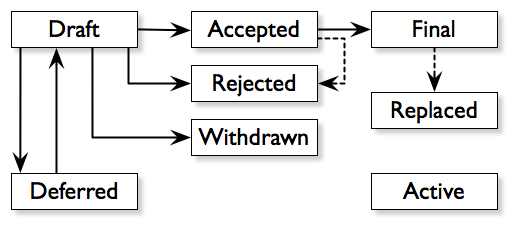

.. _the-community:

The Community
=============

.. image:: https://farm5.staticflickr.com/4225/34689432801_78d97ecec9_k_d.jpg

BDFL
----

Guido van Rossum, the creator of Python, is often referred to as the BDFL — the
Benevolent Dictator For Life.

Python Software Foundation
--------------------------

The mission of the Python Software Foundation is to promote, protect, and
advance the Python programming language, and to support and facilitate the
growth of a diverse and international community of Python programmers.

`Learn More about the PSF <http://www.python.org/psf/>`_.

PEPs
----

PEPs are *Python Enhancement Proposals*. They describe changes to Python itself,
or the standards around it.

There are three different types of PEPs (as defined by :pep:`1`):

    **Standards**
        Describes a new feature or implementation.

    **Informational**
        Describes a design issue, general guidelines, or information to the
        community.

    **Process**
        Describes a process related to Python.

Notable PEPs
~~~~~~~~~~~~

There are a few PEPs that could be considered required reading:

- :pep:`8`: The Python Style Guide.
    Read this. All of it. Follow it.

- :pep:`20`: The Zen of Python.
    A list of 19 statements that briefly explain the philosophy behind Python.

- :pep:`257`: Docstring Conventions.
    Gives guidelines for semantics and conventions associated with Python
    docstrings.

You can read more at `The PEP Index <http://www.python.org/dev/peps/>`_.

Submitting a PEP
~~~~~~~~~~~~~~~~

PEPs are peer-reviewed and accepted/rejected after much discussion. Anyone
can write and submit a PEP for review.

Here's an overview of the PEP acceptance workflow:

Python Conferences
--------------------------

The major events for the Python community are developer conferences. The two
most notable conferences are PyCon, which is held in the US, and its European
sibling, EuroPython.

A comprehensive list of conferences is maintained at `pycon.org <http://www.pycon.org/>`_.

Python User Groups
--------------------------

User Groups are where a bunch of Python developers meet to present or talk
about Python topics of interest. A list of local user groups is maintained at
the `Python Software Foundation Wiki <http://wiki.python.org/moin/LocalUserGroups>`_.
